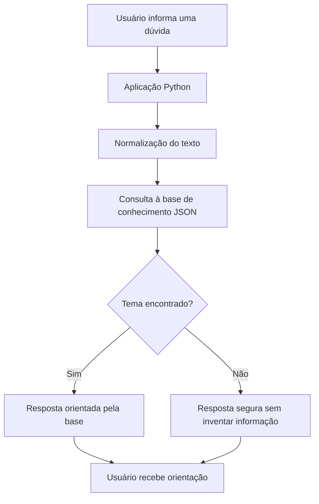

# Arquitetura do Projeto

## Descrição

O projeto usa uma arquitetura simples para demonstrar o funcionamento de um assistente virtual baseado em conhecimento.

A aplicação recebe a pergunta, compara com palavras-chave cadastradas e retorna a melhor orientação disponível. Quando não encontra correspondência suficiente, o assistente evita alucinação e recomenda abertura de chamado.
